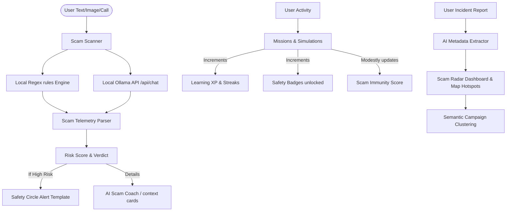

# ScamShield AI 🛡️

> **Scammers isolate. ScamShield reconnects.**  
> An accessibility-first AI cybersecurity command center designed to defend citizens against digital arrests, payment fraud, and high-pressure social engineering.

---

## 📌 Problem Statement
Digital scammers exploit fear, urgency, authority impersonation, and isolation to manipulate victims. Highly vulnerable groups—such as senior citizens, first-time smartphone users, and digital beginners—are frequently targeted by sophisticated schemes:
- **Digital Arrest**: Fraudsters impersonating police, customs (CBI), or telecom authorities (TRAI) threatening immediate arrest via fake Skype video trials.
- **UPI QR Fraud**: Disguising debit payments as "refund claims" to trick users into entering UPI PINs.
- **Urgent KYC / SIM Blocking**: Creating panic by threatening to suspend banking cards or SIM connections within hours.
- **AI Voice Cloning**: Fabricating family emergencies using voice-cloned recordings to solicit urgent bank deposits.

---

## 💡 The Solution
**ScamShield AI** is an educational safety shield that prevents fraud by increasing user "Scam Immunity." It detects threat signals, guides users to contact trusted relatives, provides interactive training simulations, and maps emerging scam vectors via community reports.

### 🌟 Key Innovations
1. **On-Device Threat Scanner**: Combines deterministic regular expression pattern matching with local LLM integration (Ollama) to parse text inputs, screenshots, or call transcripts.
2. **Guardian Mode**: An accessibility-first, high-clarity interface designed for elderly citizens. It uses simplified navigation, large typography, direct dial shortcuts, and audio read-aloud options in English and Hindi.
3. **Safety Circle Integration**: A system that combats the scammer's isolation tactic. If the scanner detects a high-risk scam, it prompts the user to contact their trusted circle before making financial decisions, auto-generating a template message.
4. **Interactive Simulation Lab**: Allows users to experience realistic, multi-path scam scenarios (Skype digital arrests, fake bank KYC texts) in a safe sandbox. 
5. **Decoupled Gamification**: Learning XP and Safety Streak tracking are separated from the **Scam Immunity Score** (preparedness index), ensuring that score values are earned through verified capability rather than arbitrary gamification points.
6. **Live Scam Radar & Campaign Clustering**: Visualizes anonymized report coordinates on a dark-neon hotspot map and shows semantic clustering graphs of incoming reports to identify potential coordinated campaigns.

---

## 🛠️ Technology Stack
- **Frontend Core**: React.js, Vite
- **Styling**: Vanilla CSS (Cyberpunk dark theme, Glassmorphic components, CSS keyframe animations)
- **Icons**: Lucide React
- **Charts & Visualization**: Recharts, Custom animated SVG flows
- **Storage & Persistence**: Local Browser Storage Sandbox (`localStorage`)
- **AI Engine**: Local Ollama Model orchestration (`llama3` / `phi3`) & heuristic regex tokenizers

---

## 🏗️ Architecture Diagram


---

## 🚀 Setup Instructions

### Prerequisites
- Node.js (v18 or higher)
- (Optional) [Ollama](https://ollama.com/) running locally for real LLM integration.

### Installation
1. Clone the project and navigate to the directory:
   ```bash
   npm install
   ```
2. (Optional) If using Ollama, start the service and download a model (e.g. `llama3`):
   ```bash
   ollama run llama3
   ```
3. Run the development server:
   ```bash
   npm run dev
   ```
4. Open the displayed local URL in your browser (typically `http://localhost:5173`).

---

## 🎯 3-Minute Hackathon Demo Flow
To make demonstrations seamless for judges, ScamShield AI includes a floating **Presentation Panel** at the bottom of the screen. Follow these steps:

1. **Step 1: Load Vulnerable Profile**: Click step 1 to configure the profile to **Rajesh Sharma** (Score: `41` - At Risk). Inspect the dashboard gauges and radar charts.
2. **Step 2: Receive Scam SMS**: Click step 2. This copies a malicious Digital Arrest text to your clipboard and navigates to the **Scam Scanner** page.
3. **Step 3: Paste & Detect**: Paste the text into the Scanner box and click **Analyze**. Review the `96% Critical Risk` verdict, which highlights the extracted signals (Authority impersonation, Arrest threats, Isolation demands).
4. **Step 4: Enable Guardian Mode**: Click step 4. Notice how the UI instantly simplifies, scaling up font sizes, displaying giant action buttons, and rendering high-contrast warning cards.
5. **Step 5: Contact Safety Circle**: Click step 5 to navigate to the **Safety Circle** page. Click **Contact** on Priya's (Daughter) card to see the pre-populated template alert designed to break isolation.
6. **Step 6: Digital Arrest Simulation**: Click step 6 to navigate to the **Simulation Lab** where users practice resisting pressure from impersonated officials.
7. **Step 7: Complete Lab**: Click step 7. This simulates passing the trial. Navigate to the dashboard to see the Immunity Score increase to `54` and the **Digital Arrest Defender** badge unlock.
8. **Step 8: Check Scam Radar**: Click step 8 to view the live dark-neon map of India showing regional hotspots, trend stats, and coordinated campaign clusters.

---

## 🛡️ Privacy and Safety Disclosures
- **On-Device Privacy**: By default, all scan histories, user profiles, safety circle contacts, and configurations are stored inside the browser's local sandbox (`localStorage`).
- **Affiliation Disclaimer**: ScamShield AI is an independent educational tool. It is **not** an official platform of the Central Bureau of Investigation (CBI), Reserve Bank of India (RBI), NCRB, State Police departments, or the Government of India.
- **Reporting Resources**: Live fraud incidents should be officially reported immediately to the National Cyber Crime Helpline at **1930** or online at **cybercrime.gov.in**.
